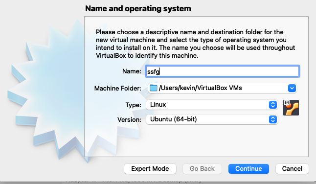

**BOOTING UBUNTU USING VIRTUAL BOX (Manual Process)**

1. Install a virtual box in the mac machine if not already present

2.Install ubuntu iso image from ubuntu official site

	ubuntu.com ----> click on downloads ----->download latest version

3.now in mac, go to finder ----> application ------>virtual box

4.Inside virtualbox , click on new for creating a new VM for OS

5.Name the OS and the type and version and click on continue

 

6.select the memory size of your convenience and continue

7.select create virtual hard disk and continue

8.select VDI and dynamically allocated in the next 2 windows

9.select the file location and storage for the virtual machine

10.New virtual machine will be created

11.now to install ubuntu inside virtual machine

12.click on settings and move to storage

13.Under controller:IDE click on empty and click on the disk logo beside IDE primary 1

14.Now you will be able to select the iso file from the downloads, select the ubuntu iso file that was downloaded and click OK

15.In the home page click on the big green right arrow which says start to launch the virtual machine

**TO INSTALL UBUNTU ON A VIRTUAL MACHINE**

1. Now you will be asked to try and install ubuntu, click enter and the installation page will appear

2.click on Install Ubuntu and on next pages

3.choose language and select normal installation and download updates while installing ubuntu

4.click on erase disk and install ubuntu

5.next select the location and fill out the form with a user name with a password

6.Ubuntu will start to install and the ubuntu machine will boot

7.At first you will be prompted for a restart inorder to use new installation, click restart to restart the machine

