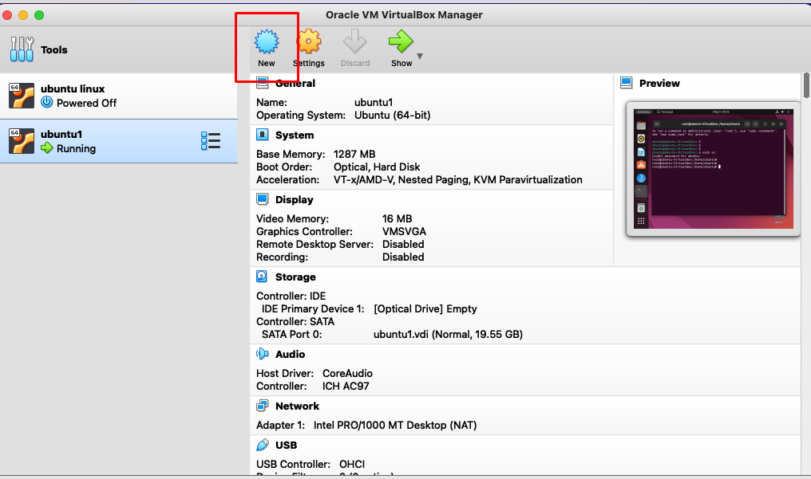

**ENABLING HARDWARE VIRTUALIZATION IN MAC MACHINE**

The "VT-x is not available" error occurs when the hardware virtualization is not enabled on the Mac Machine

To enable VT-x in mac,

-the mac has to be updated to the latest software 

-by resetting the NVRAM in your mac by clicking the combination "**OPTION + COMMAND + P + R**"

To check if the VT-x is enabled:

	$ sysctl -a | grep machdep.cpu.features 

check whether VMX is listed in the below list

					(OR)

	$ sysctl -a | grep -o VMX

	

By executing the above command, VMX will show up if VT-x was enable if not it wont

SCRIPT TO ENABLE IT IN YOUR MAC MACHINE:	

	

#!/bin/bash

sysctl -a | grep -o VMX

if [[ -n $output ]]

then

    printf "%s\n" "VT-x is enabled"

else

    printf "VT-x is disabled"

    osascript -e 'tell application "Terminal" to set miniaturized of every window to true'

    sleep 8

    /usr/local/bin/cliclick c:.

    osascript -e 'tell application "System Events" to keystroke "p,r" using {option down, command down}'

fi

