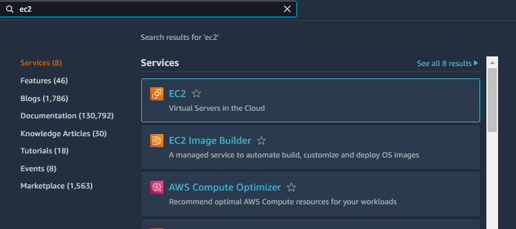
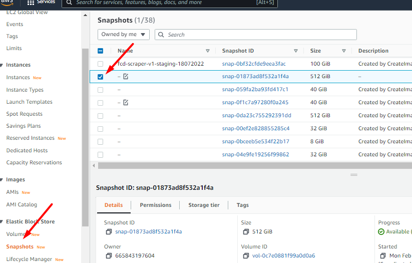
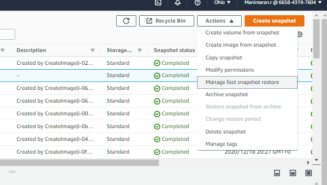
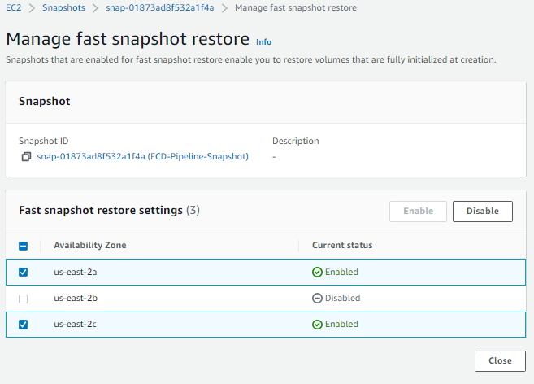

## STEPS TO DISABLE FAST SNAPSHOT RESTORE DATA SERVICES

1.Login to AWS Console and search for EC2

2.Click on snapshot in the left navigation

3.Choose the snapshot that you want to disable the feature 

4.Click Actions ----> Manage fast snapshot restore

5.Now choose the AZ for which the feature is enabled and click disable.

6.Close the page
