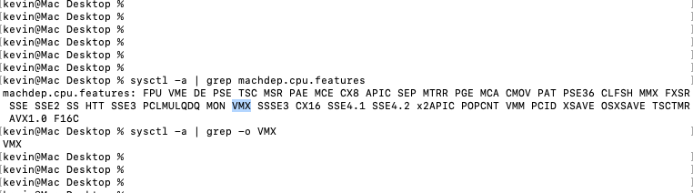
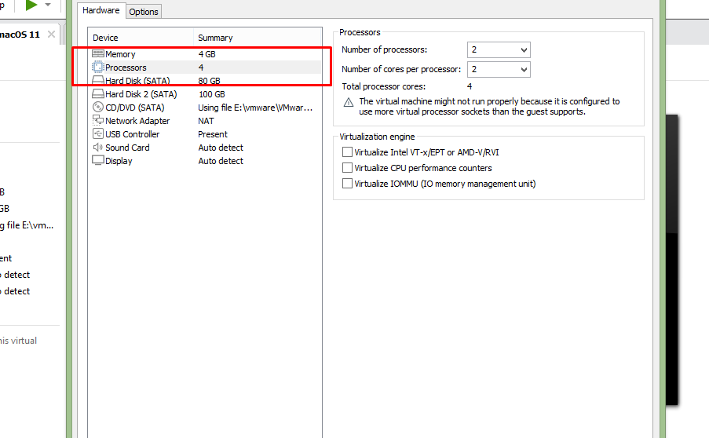

**VT-x ERROR**

-If this error occurs while connecting to the ubuntu image using virtual box in mac VM

-The virtual technology must be enable 

**To enable Virtual Technology:**

-make sure the mac VM is shut down 

-click on the edit virtual machine settings

	

-Under processor check the Virtualize Intel VT-x/EPT or AMD-v/RVI

-After checking the box, click ok and switch on the mac machine

-Now if you try to launch the ubuntu machine inside the mac using virtual box. It will start to boot

