                       

                                         **Socios Documentation**

# **Socio Formula**

* Socios formula is a package definition written in Ruby.

* It can be created with brew create <URL> where <URL> is zip or tarball. 

              $ brew create [https://github.com/SociOS-Linux/socios/archive/refs/tags/v1.3.6.tar.gz](https://github.com/SociOS-Linux/socios/archive/refs/tags/v1.3.0.tar.gz)

* Installed with brew install <formula>command  & debugged with brew install --debug.

$ brew install package-name

	$ brew install package --debug

**Socios terminology**

<table>
  <tr>
    <td>Terms</td>
    <td>Description</td>
    <td> Example</td>
  </tr>
  <tr>
    <td>Formula</td>
    <td>Package definition uses the path </td>
    <td>/usr/local/Homebrew/Library/Taps/homebrew/homebrew-core/Formula/socios.rb</td>
  </tr>
  <tr>
    <td>Keg</td>
    <td>Installation prefix of a Formula</td>
    <td>/usr/local/Cellar/Socios/v1.3.6</td>
  </tr>
  <tr>
    <td>Cellar</td>
    <td>All Kegs are installed in path</td>
    <td>/usr/local/Cellar</td>
  </tr>
  <tr>
    <td>Tap</td>
    <td>Git repository of Formulae and/or commands</td>
    <td>/usr/local/Homebrew/Library/Taps/homebrew/homebrew-core</td>
  </tr>
  <tr>
    <td>Bottle</td>
    <td>Pre-built Keg used instead of building from source</td>
    <td>qt-4.8.4.catalina.bottle.tar.gz</td>
  </tr>
</table>

# **An Introduction**

* Homebrew uses Git for downloading updates and contributing to the project.

* Homebrew installs to the Cellar and then symlinks some of the installations into /usr/local 

* Packages are installed according to their formulae, which live in 

/usr/local/Homebrew/Library/Taps/homebrew/homebrew-core/Formula/socios.rb

# **Basic Instructions**

* Before we can start need to update the Repository. This turns our Homebrew installation into a Git repository.

* Before submitting a new formula make sure our package

* Check All our Acceptable Formula requirements.

* Passes all brew audit --new-formula <formula> tests

Reference URL:  [https://docs.google.com/document/d/1VOfEAn4aYBdE7l_Kc9hk-EsGQXKLoJiCCtY7q3skwwQ/edit?usp=sharing](https://docs.google.com/document/d/1VOfEAn4aYBdE7l_Kc9hk-EsGQXKLoJiCCtY7q3skwwQ/edit?usp=sharing)	

* In the above documentation, we have mentioned all Tag, version, Release, and formulas in detail.

# **Install the formula**

* Open MAC machine terminal. Now we need to set a socios repository name with brew tap repo.

* The brew tap command adds more repositories to the list of formulas that Homebrew tracks, updates, and installs from. Run the following command in the terminal.

	$ brew tap SociOS-Linux/socios

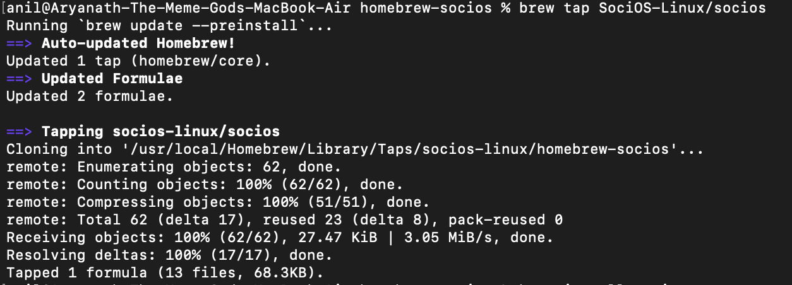

* Above command is initializing our package with the brew repository. Once the brew tap execution is completed.

* We need to install the socios formula in the MAC machine using the below command.

	$ brew install socios

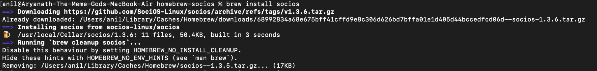

* The Socios installation is completed. We can able to use the "socios" command in the MAC machine also we can check the version of our package using the below command.

	$ socios –version

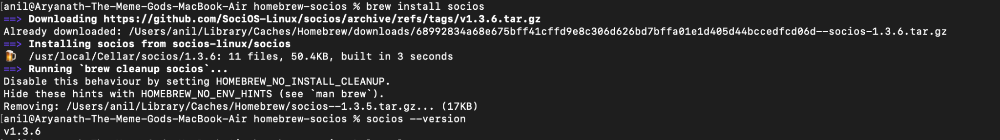

# **Step1:  Install virtual box in MAC machine with the latest version**

* Once we verified with Socios version. We can start to install Virtual Box and Download the Ubuntu ISO image on the MAC machine.

* In this function, we have added the Virtualbox installation commands and ISO image downloading command in the script file.

	$ socios init

Drive details: We have created a separate drive for the Ubuntu iso image and updated the ImageID and ISO ImageURL in the Image script file 

Mail ID:      socios.setup@gmail.com

Password: Arya143$

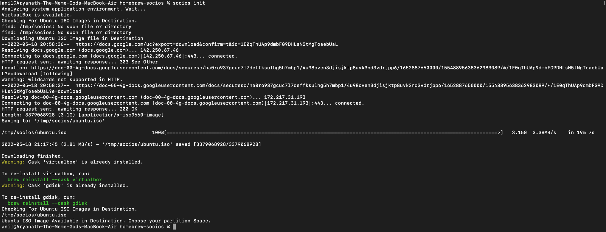

Reference Documentation: [https://docs.google.com/document/d/1PQFOSeFuEH0rISVxM-Hw60s8AGVopTlQEdAWVg_IkFA/edit?usp=sharing](https://docs.google.com/document/d/1PQFOSeFuEH0rISVxM-Hw60s8AGVopTlQEdAWVg_IkFA/edit?usp=sharing)	

**Step2:  Create Virtual Machine in Virtual Box & Booting the ISO image in Virtual box**

* We can able to check the VirtualBox image in Launchpad

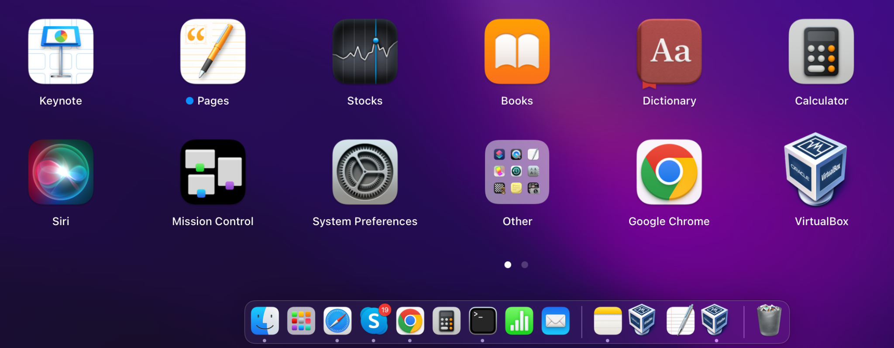

* Open the Terminal, Now we need to run the below command to create a Virtual machine and Booting the ISO image file 

	$ socios build

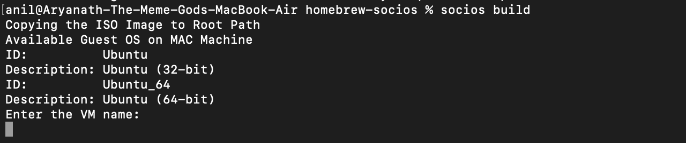

* Once we execute the above command in the terminal we need to give some user inputs

* Enter the VM Name: Socios-VM

* Then press enter, here we can able to view the Disk space from the hard disk.

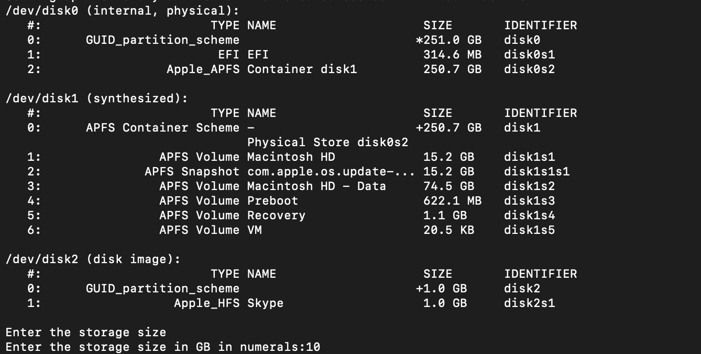

* Now we need to enter the Storage size in GB  Example: 10, After the size is given in GB, the script will convert the value into MB and proceed for the next command

* Once the Virtual disk is created. We have associated the SATA Controller & IDE controller with the Virtual Machine

* Then the ISO image is booted in VM and starts launching the Virtual machine in the virtual box

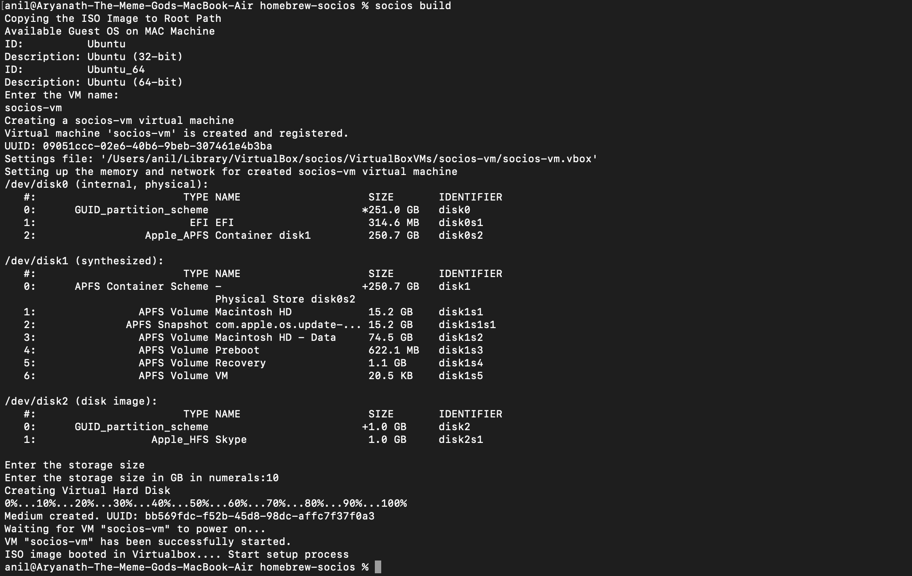

* Once the VirtualBox popup box will appear. We need to configure the Linux machine in a Virtual box.

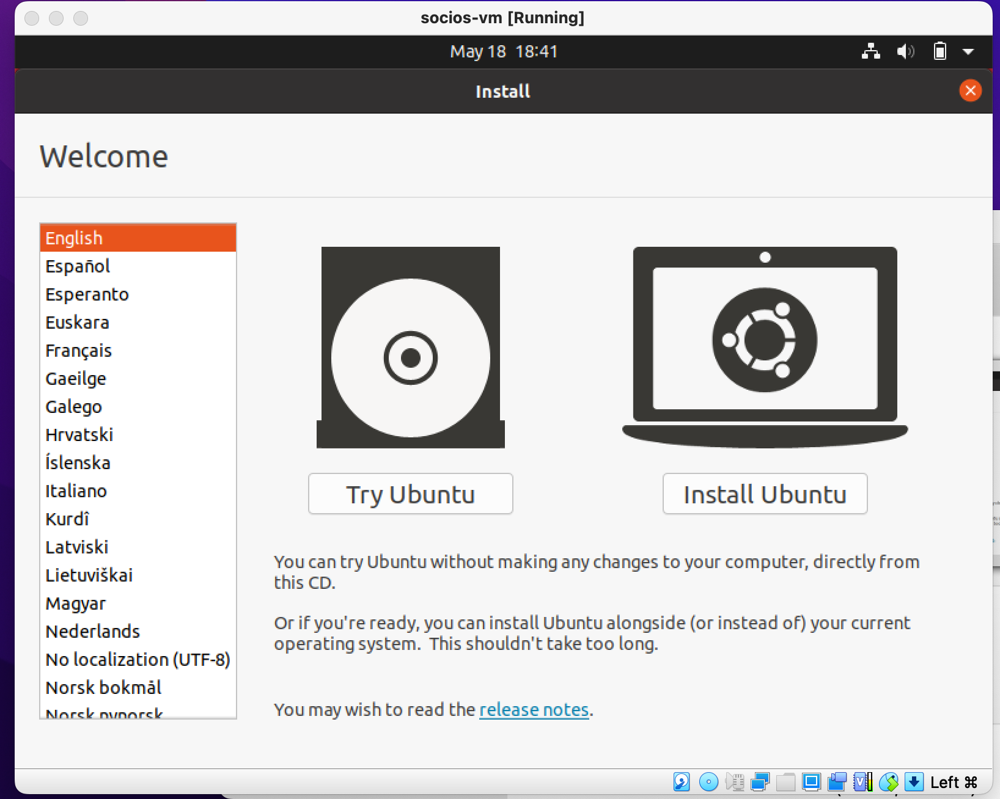

* Select the language option " English" and click on “Install Ubuntu”

* Click on Continue 

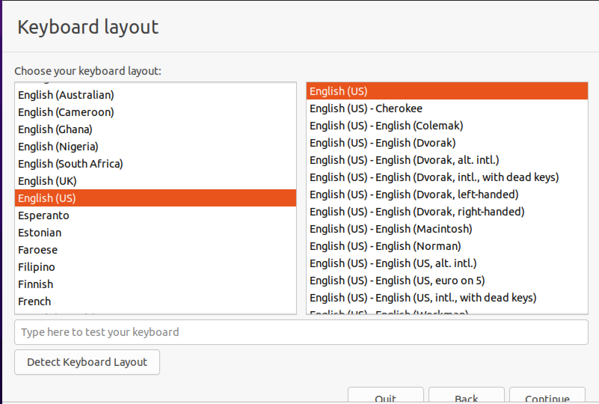

*  click on Continue

* Click on Install Now

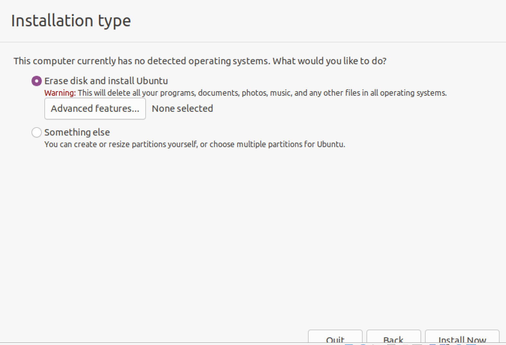

* Popup screen will appear. Then click on continue.

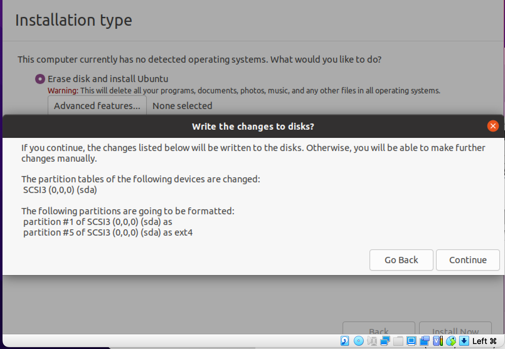

* Follow the installation procedure and fill the Who are you Screen.

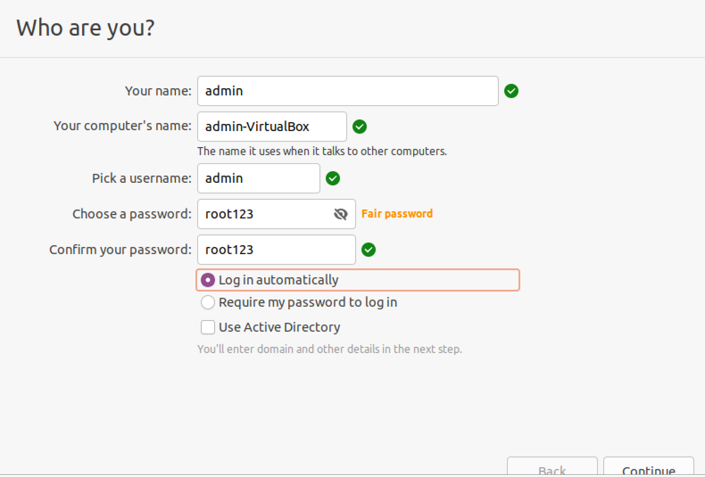

* Once done with instruction - Click on continue

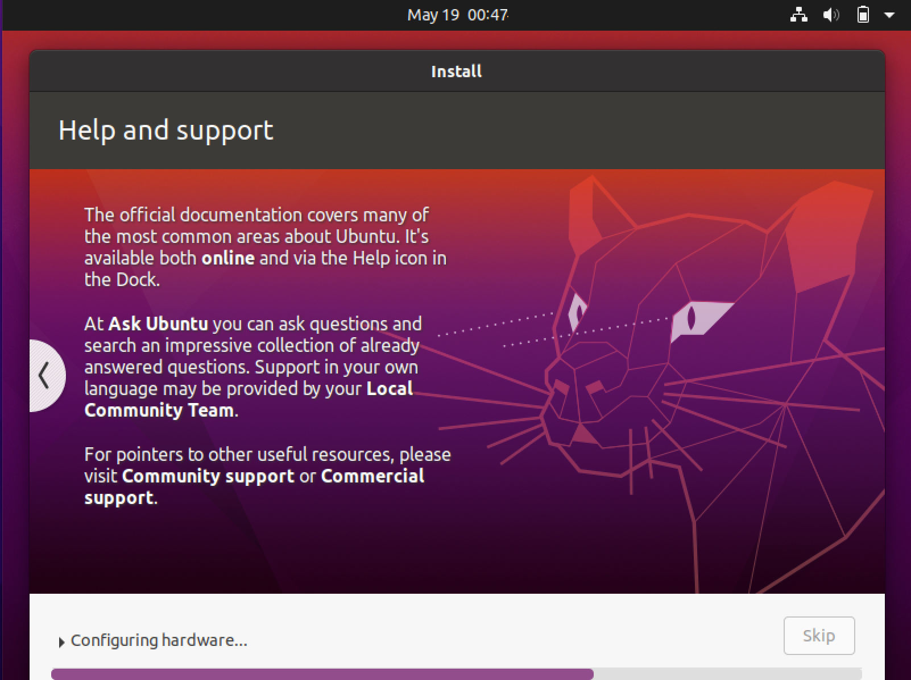

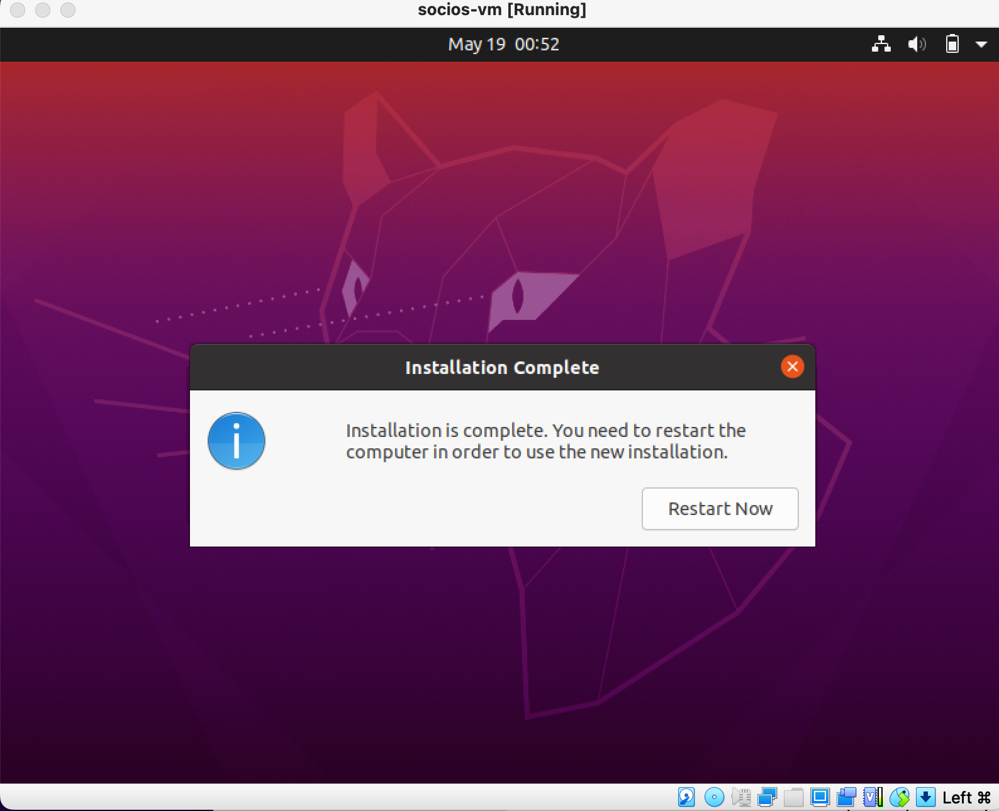

* Click on Restart - Once restart will done.

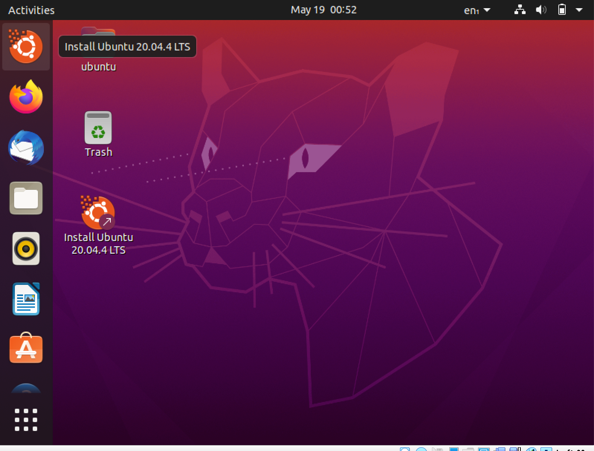

