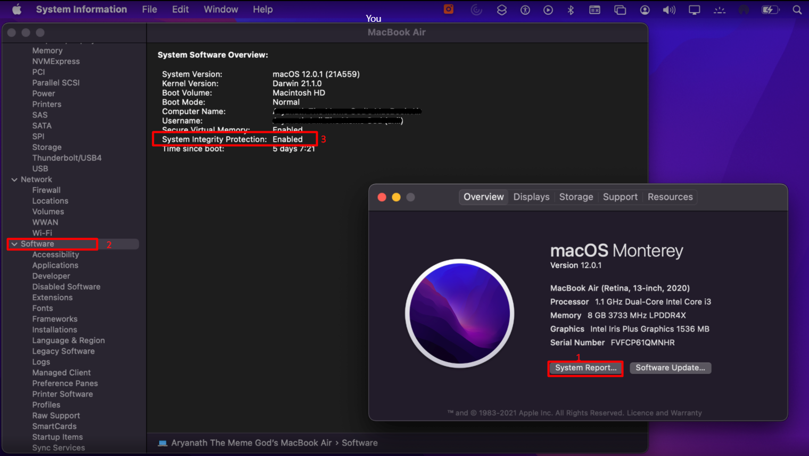
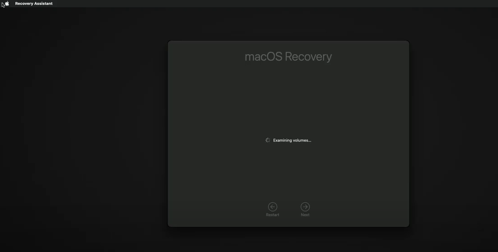
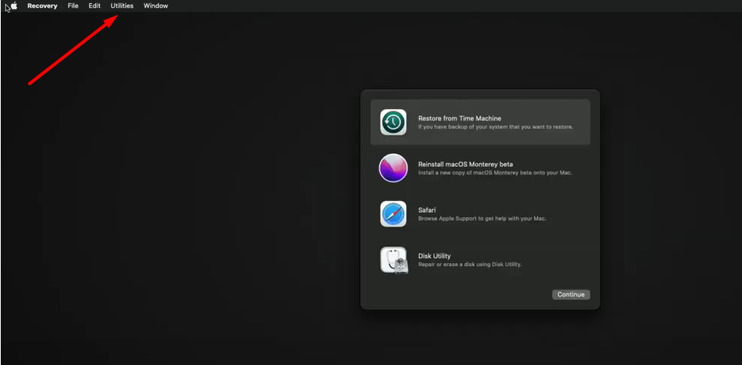
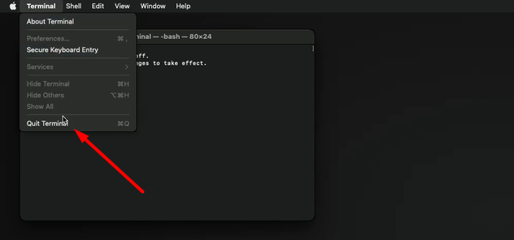
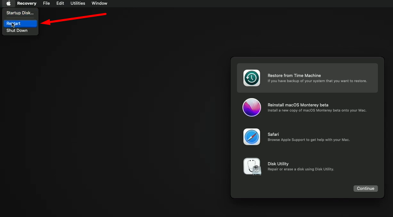
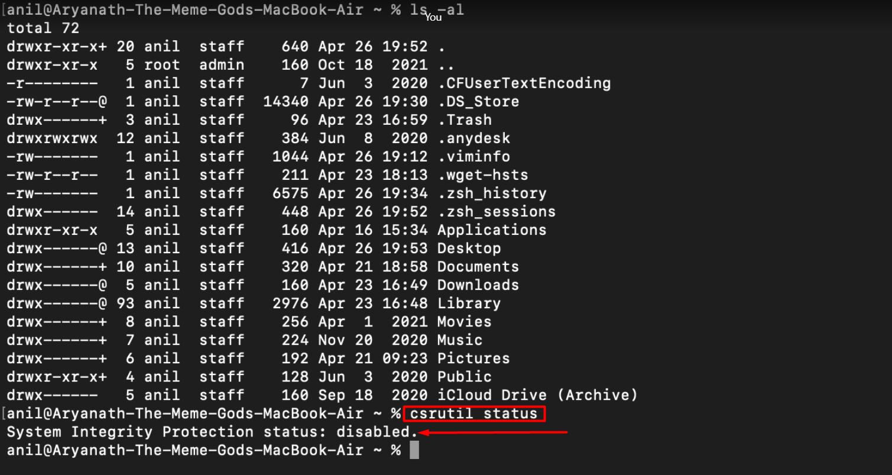
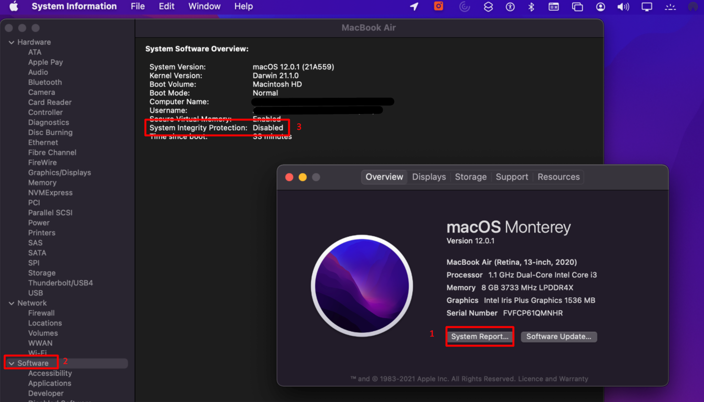
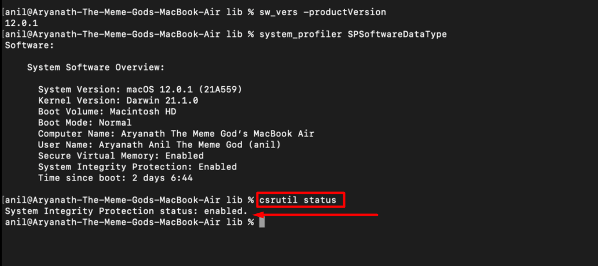

**        **

**                  ****Enable & Disable System Integrity Protection (SIP) on Mac**

**Step1:  Turn off System Integrity Protection (SIP) on Mac.**

* Click on the "Apple Icon" - Click on “about this MAC” then Click on “System reports”

* Now click on the Software section we can able to the SIP status

* Turn off the MAC machine or device

* Now we need to enter recovery mode to edit system settings and disable System Integrity Protection on Mac. 

* Hold down Command-R and press the Power button. Keep holding Command-R until the Apple logo appears.

* Select the User and enter the password - Click on continue 

*  Wait for OS X to boot into the OS X Utilities window.

* Click on Utilities then select the terminal option. Now open Terminal and enter the  Below Command in terminal 

$ csrutil status

* Check the status on SIP in MAC Machine if it is enabled - We need to Disable the SIP option on the Mac machine

$  csrutil disable

* Now Click on the Quit terminal. Now we need to restart the Mac machine.

* Once restart done. 

* Open the terminal and check the status of the SIP option.

$ csrutil status

**Step2:  Turn on System Integrity Protection (SIP) on Mac.**

* Click on the "Apple Icon" - Click on “about this MAC” then Click on “System reports”

* Now click on the Software section we can able to the SIP status

* Turn off the MAC machine or device

* Now we need to enter recovery mode to edit system settings and Enable System Integrity Protection on Mac. 

* Hold down Command-R and press the Power button. Keep holding Command-R until the Apple logo appears.

* Select the User and enter the password - Click on continue 

*  Wait for OS X to boot into the OS X Utilities window.

* Click on Utilities then select the terminal option. Now open Terminal and enter the  Below Command in terminal 

$ csrutil status

* Check the status on SIP in MAC Machine if it is Disable - We need to Enable the SIP option on the Mac machine

$  csrutil Enable

* Now Click on the Quit terminal. Now we need to restart the Mac machine.

* Once restart Done. 

* Open the terminal and check the status of the SIP option.

$ csrutil status

